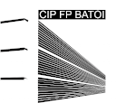

# BatoiBooks

## - MAIN preparación inicial del proyecto, y primera practica - [ir](https://github.com/Desarrollo-Cliente/BatoiBooks).
## - 2-Arrays cambios realizados en la practica dos - [ir](https://github.com/Desarrollo-Cliente/BatoiBooks/tree/2-Arrays).
## - 3-Clases cambios realizados en la practica tres - [ir](https://github.com/Desarrollo-Cliente/BatoiBooks/tree/3-Clases).
## - 4-Persistencia cambios realizados en la practica cuatro - [ir](https://github.com/Desarrollo-Cliente/BatoiBooks/tree/4-Persistencia).